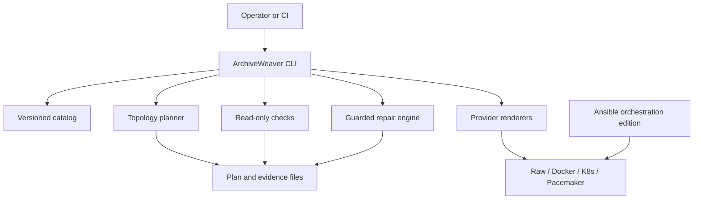
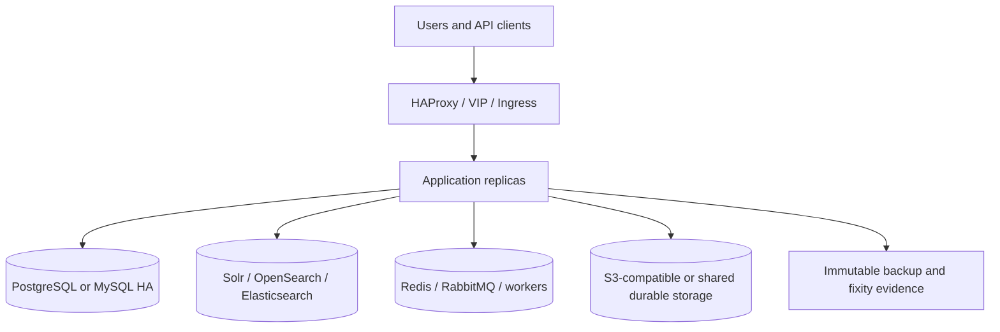

# High-Level Design (HLD)

## 1. Purpose

ArchiveWeaver is an operations control plane and reference deployment kit for digital-archiving products. It provides:

- a versioned catalog for the 30 requested products;
- a common deployment and topology vocabulary;
- safe planning for raw/native, container, cluster-manager, Kubernetes-style runtimes, and Ansible orchestration;
- read-only host, service, HTTP, storage-path, and configuration checks;
- explicit, gated repair actions;
- English and Turkish operator documentation;
- a format-family catalog and per-product capability notes.

ArchiveWeaver does not replace the upstream application, its database, its search engine, its storage system, or its license. It also does not silently claim that a product is vendor-supported on every operating system or orchestrator. The catalog records the difference between an upstream/native path and a portable infrastructure pattern.

## 2. Design goals

1. **Safe by default.** Planning and checking are read-only. Repair requires an explicit `--apply`.
2. **Idempotent operations.** Re-running a plan or reconciliation should converge on the declared state without deleting data.
3. **Product-neutral core.** Product facts live in the catalog; execution policy lives in the engine.
4. **State-aware HA.** Application replicas, databases, queues, search indexes, object storage, and file storage are modeled separately.
5. **Evidence-driven support.** Every product entry links to its upstream repository, documentation, and homepage.
6. **Quorum-aware topology.** Two-node consensus systems are blocked or require an external quorum/witness decision.
7. **Auditable change.** Deployment inputs, checks, repair plans, command output, checksums, and backup evidence are retained by the operator.
8. **Least privilege.** The control plane never needs application data access merely to render a plan.

## 3. Non-goals

- Repackaging or redistributing the upstream products.
- One universal Docker image for all products.
- Treating a framework such as Hyrax or Islandora as if it were a single binary.
- Automatically changing production firewall, SELinux/AppArmor, STONITH, database, or storage state.
- Recommending two control-plane nodes as failure-tolerant HA without a quorum design.

## 4. Logical architecture

The CLI is intentionally stateless. A deployment system such as GitLab CI, GitHub Actions, Ansible, Flux, Argo CD, or an internal change-management process may store the generated plan and evidence. ArchiveWeaver does not require one specific CI/CD product.

## 5. Runtime abstraction

The engine exposes ten modes (nine underlying runtimes plus the Ansible orchestration adapter):

| Mode | Primary responsibility | Recommended HA shape |
| --- | --- | --- |
| Raw / native | Upstream package, source, binary, or systemd deployment | Native app cluster or Pacemaker active/passive; externalize state |
| Docker Compose | Single-host multi-service packaging | One host; use Swarm/Kubernetes for multi-host scheduling |
| K3s | Lightweight Kubernetes scheduling and control plane | 3 or 5 server nodes with embedded etcd; external CSI/object storage |
| RKE2 | Hardened Kubernetes distribution | 3 server nodes, then agents for workload isolation |
| Pacemaker / Corosync | Cluster resource orchestration and failover | Active/passive with tested STONITH and quorum/witness |
| Podman Quadlet | systemd-managed containers | Single host; Pacemaker for active/passive failover |
| k0s | Kubernetes distribution | 3 or 5 controllers with etcd; workers as required |
| Docker Swarm | Multi-host container scheduling | Odd number of managers, normally 3 or 5 |
| MicroK8s | Kubernetes distribution | 3 or 5 control-plane nodes with HA datastore |
| Ansible orchestration | Version-controlled host/configuration management | Coordinates an underlying runtime; does not provide HA, quorum, or fencing |

Support levels in the catalog are deliberately precise:

- **native:** the upstream project has a source/package/install path suitable for this mode;
- **validated:** the upstream project documents or publishes a deployment path for this mode;
- **portable:** ArchiveWeaver can render/check the infrastructure pattern, but the product's application-level HA and state behavior require validation;
- **conditional:** possible only after an explicit design review, release pin, and failure test;
- **not-recommended:** blocked by the planner unless a documented exception is supplied.

## 6. Common service decomposition

Most archive products fall into one of these shapes:

### 6.1 Repository / research-data shape

Web/API nodes are stateless or mostly stateless. PostgreSQL, Solr/OpenSearch, Redis/RabbitMQ, and S3/NFS/CSI storage hold the durable state. InvenioRDM, DSpace, Dataverse, Fedora, Hyrax, EPrints, and similar systems fit this pattern, with product-specific differences.

### 6.2 Digital-preservation workflow shape

An intake/dashboard layer schedules long-running jobs. Worker processes run format identification, virus scanning, normalization, packaging, fixity, and storage transfers. Archivematica, RODA, Asalae, and Kitodo/Goobi require workflow-aware checks in addition to a web HTTP probe.

### 6.3 DMS/ECM shape

Web/API nodes are combined with background workers, OCR, preview/transform services, search, database, and durable content storage. Mayan EDMS, Paperless-ngx, Papermerge, Alfresco, Teedy, LogicalDOC, OpenKM, SeedDMS, and Docspell require dependency-aware readiness.

### 6.4 DAM/collections/description shape

A web application manages metadata and derivatives while the media store may be local, shared, or object-backed. ResourceSpace, Omeka S, CollectiveAccess, AtoM, ArchivesSpace, and Islandora have different metadata and web-publication models; the catalog therefore names their expected dependency families rather than using one generic “DMS” assumption.

## 7. Reference HA architecture

The recommended production baseline is a three-node control plane with a separate or externalized state layer:

Control-plane HA and application HA are separate failure domains:

- three RKE2/K3s/k0s/MicroK8s server/controller nodes protect scheduler and cluster state;
- three or more app replicas protect the web/API tier only;
- database, search, queue, and storage need their own replication and restore design;
- a load balancer/VIP needs health checks and a failure-domain strategy;
- backups are required even when every component is replicated.

## 8. Node-count patterns

### Standalone

Use for evaluation, development, small archives, or a deliberately accepted single failure domain. Keep a separate backup target. A successful HTTP probe is not production HA.

### Two nodes

Use only after choosing one of these patterns:

1. active/passive Pacemaker with tested STONITH, quorum handling, and shared/replicated state;
2. two application workers in front of an external HA database/search/storage platform;
3. two RKE2 servers backed by an external quorum-capable datastore, understanding that the application layer still needs independent HA;
4. a development/test topology with an explicitly accepted quorum risk.

Do not run two embedded-etcd control-plane nodes or two Swarm managers and call that failure-tolerant HA.

### Three nodes

This is the minimum recommended consensus baseline for RKE2, K3s, k0s, MicroK8s, and Swarm managers. Distribute nodes across independent power, storage, and network failure domains when possible. Co-located control plane and workloads are acceptable for small installations only if resource pressure is measured.

### Three-plus nodes

Separate control-plane, worker, storage, database, search, and workflow pools when scale or operational isolation justifies it. Use anti-affinity and topology spread constraints. Add managers/controllers in odd numbers for consensus rather than adding arbitrary even numbers.

## 9. Data protection architecture

The minimum protected set is:

- application database and database credentials;
- original bitstreams and derivatives;
- object/file-storage metadata and bucket policy;
- search/index configuration and rebuild procedure;
- queue/workflow state where it affects preservation processing;
- application configuration, secrets references, TLS assets, and release manifest;
- fixity manifests, preservation events, audit logs, and change records;
- cluster datastore snapshots and infrastructure-as-code.

Use the 3-2-1 rule, immutable/offline copies where possible, encryption in transit and at rest, periodic restore tests, and a documented RPO/RTO per collection. Replication is not a substitute for restore.

## 10. Security architecture

- TLS terminates at an approved ingress/reverse proxy and is re-encrypted to backends where policy requires it.
- Secrets are supplied through an approved secret manager, Kubernetes Secret encryption, or protected environment files; never commit them.
- The Ansible edition keeps apply disabled by default, uses host-key verification and reviewed become policy, requires explicit backup/release/approval gates, and writes redacted evidence without credentials or document content.
- Container images are pinned by digest or approved immutable tag and scanned before promotion.
- Run services as non-root when upstream support permits; use `no-new-privileges`, dropped capabilities, seccomp, SELinux/AppArmor, and read-only paths where compatible.
- Restrict database/search/queue ports to application networks.
- Use application-native LDAP/OIDC/SAML integrations rather than bypassing authentication in health checks.
- Treat format converters and OCR binaries as an attack surface; sandbox or isolate them when possible.

## 11. Observability and acceptance

Every deployment should expose or collect:

- HTTP readiness and liveness;
- service/process state and restart count;
- database connection and migration state;
- search cluster health and indexing lag;
- queue depth and failed jobs;
- storage capacity, inode pressure, object-store errors, and fixity failures;
- backup age, restore test result, and checksum verification;
- cluster quorum, node readiness, fencing state, and event logs.

The acceptance gate is: catalog validation, plan review, a 100/100 release
readiness report, dependency readiness, smoke test, backup verification,
failure test, and a sealed evidence index.

