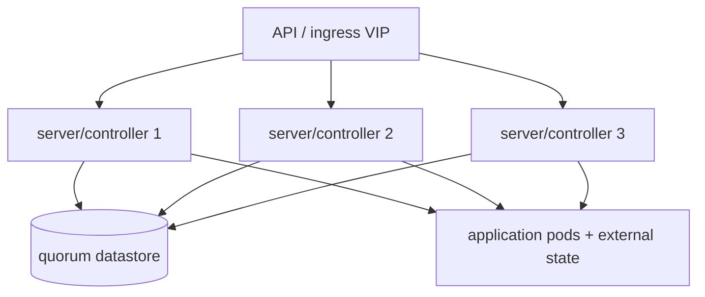

# Three-node deployment

Three nodes are the normal minimum for production consensus-based HA. The application workload may run on the same nodes for small installations, but storage and database pressure must be measured.

## RKE2/K3s/k0s/MicroK8s baseline

Use three servers/controllers, an API endpoint/load balancer, a supported CNI, ingress, CSI, and snapshot/restore. Add agents/workers when application CPU, OCR, media conversion, or workflow jobs would starve the control plane.

## Application state

- prefer an external HA PostgreSQL/MySQL service;
- use a search service with a tested replica/shard design;
- use Redis/RabbitMQ according to the product's task model;
- use S3-compatible object storage or a proven RWX filesystem;
- keep original content and preservation evidence separate from ephemeral search indexes;
- set topology spread and anti-affinity for application replicas;
- use PodDisruptionBudgets and graceful termination.

## Three-node Swarm

Use three managers and optionally workers. Keep manager quorum independent from application replicas. A local volume on each node is not shared storage; use a tested distributed volume driver or schedule stateful services deliberately.

## Acceptance

Verify one control-plane/manager failure, one application pod/container failure, one database/search dependency failure, one storage failure, and one restore path. Capture the output in the evidence bundle described in the LLD.

